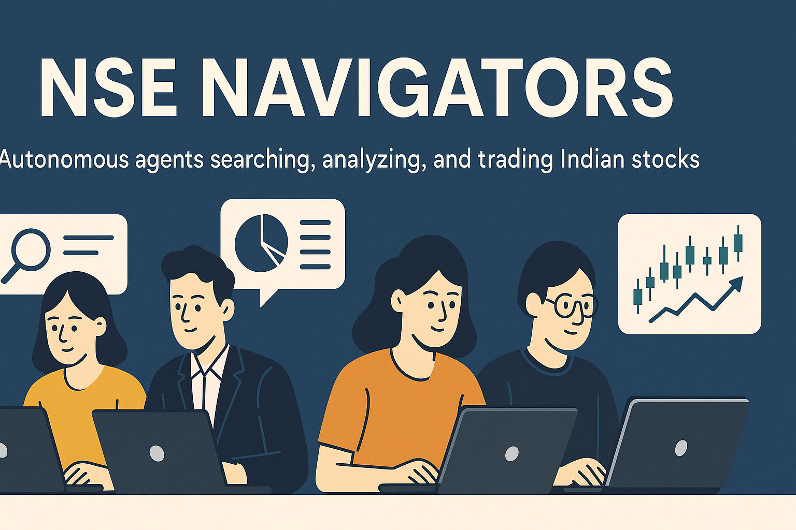
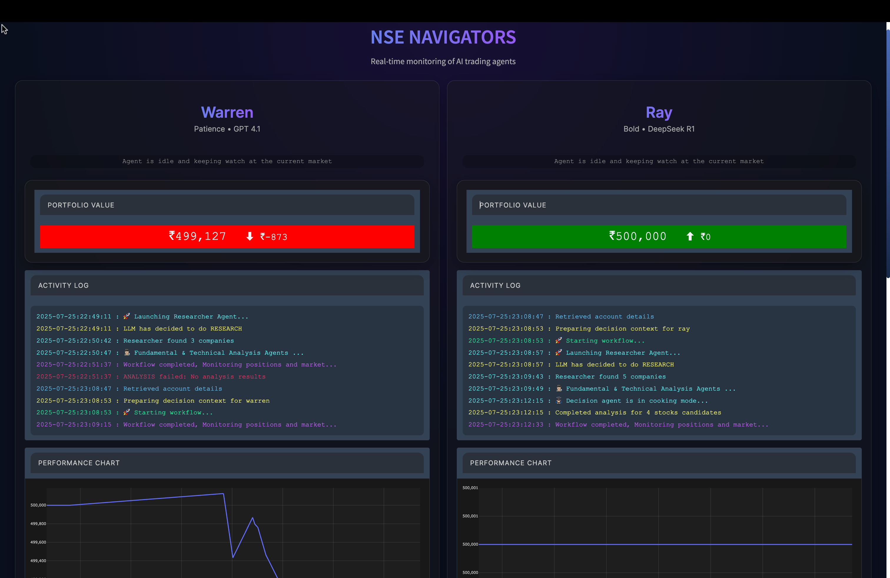

# 🚀 NSE Navigators: Autonomous Multi-Agent Indian Stock Trading System



> **NSE Navigators** is a next-generation, fully autonomous, multi-agent trading platform for Indian equities. Harnessing the power of LLMs, agentic workflows, and robust financial data tools, it delivers research, analysis, and trading—end-to-end, with zero manual intervention.

---

## 🌟 Key Features

- **Multi-Agent Intelligence:**
  - Six specialized AI agents, each with unique trading strategies and risk management protocols.
  - Agents autonomously research, analyze, and execute trades on Indian stocks.
  
  **Agent Types:**
  - **Manager Agent:** Oversees the entire trading workflow, monitors portfolio, coordinating other agents.
  - **Research Agent:** Conducts in-depth research on stocks, sectors, and market trends.
  - **Fundamental Analyst Agent:** Analyzes financial statements, ratios, and company fundamentals.
  - **Technical Analyst Agent:** Performs technical analysis using advanced indicators and chart patterns.
  - **Decision Agent:** Takes the reports from technical and fundamental agents to pick the best stocks.
  - **Execution Agent:** Executes trades based on decisions made by the Manager Agent

- **Integrated Financial Data & Symbol Tools:**
  - Fast, robust symbol resolution and financial data extraction using MCP tools.
  - Batch and cached price fetching with rate-limit-safe, multi-agent support.
  - Analyzes past one year of data for each stock to identify trends and patterns.
  - Analyzes financial data to identify undervalued stocks.

- **Agentic Workflows:**
  - Agents coordinate: one scouts market opportunities (news/trends), others perform deep financial, fundamental, and technical analysis.
  - All actions are transparent and traceable via a live dashboard.

- **Modern UI:**
  - Intuitive Gradio dashboard for real-time monitoring of agent activities, trades, and portfolio performance.

- **MCP Tooling:**
  - Modular, async-ready MCP tools and servers for symbol resolution, price/financials fetching, and Playwright-powered scraping.

- **Robust Engineering:**
  - Global, thread-safe price cache (5-min TTL, 1-sec API rate limit compliance).
  - End-to-end error handling, async best practices, and modular project structure.
  - Redis integration for fast, in-memory symbol resolution and caching.

---

## 🤖 How It Works

1. **Manager Decides:**
   - At every market hour, the Manager Agent decides the next action based on portfolio status and market conditions.
2. **Researcher Agent:**
   - If the decision is to research, it fetches news, trends, and performs deep analysis using LLMs. and filter out 4-6 stocks.
3. **Fundamental & Technical Workflows:**
   - Those stocks get further analyzed by the Fundamental Analyst and Technical Analyst Agents.
   - They generate detailed reports on each stock's financial health and technical indicators.
4. **Decision Work:**
   - Those reports are sent to the Decision Agent, which evaluates and selects the best candidates for trading.
5. **Execution:**
    - The Execution Agent executes trades based on the Decision Agent's recommendations.
    - Sends a push notification with trade details.
    - Sets a stop-loss and take-profit or book loss for each trade.
6. **Live Dashboard:**
   - Monitor agent actions, activity logs, trades, and portfolio value, strategies and transactions in a beautiful UI.

---

## 🛠️ Installation & Setup

1. **Clone the repo:**
   ```sh
   git clone https://github.com/DarshanR1510/nse-navigators.git
   cd nse-navigators
   ```
2. **Install Python dependencies:**
   ```sh
   pip install -r requirements.txt
   ```
3. **Install Node.js dependencies (for Playwright MCP server):**
   ```sh
   cd mcp && npm install && cd ..
   ```
4. **Set up environment variables:**
   - Copy `.env.example` to `.env` and fill in your API keys (DHAN, OpenAI, etc).

---

## 🖥️ Usage

- **Start the Gradio UI:**
  ```sh
  python app.py
  ```
- **Run Trading Floor:**
  ```sh
  python trading_floor.py
  ```
  # ...
  ```
- **Test agent workflows:**
  - Use provided notebooks/scripts for end-to-end testing.

---

## 📊 Live Dashboard Preview



---

## 📝 License

MIT License. See [LICENSE](LICENSE) for details.
---

## 👤 Author

- **Darshan Ramani**  
  [darshanramani1@gmail.com](mailto:darshanramani1@gmail.com)
  [GitHub](https://github.com/DarshanR1510)
  [LinkedIn](https://www.linkedin.com/in/darshanramani/)
  [email](mailto:darshanramani1@gmail.com)
---

## ⭐ Star this repo if you like it!

> _NSE Navigators: The future of AI-driven Indian stock trading._
