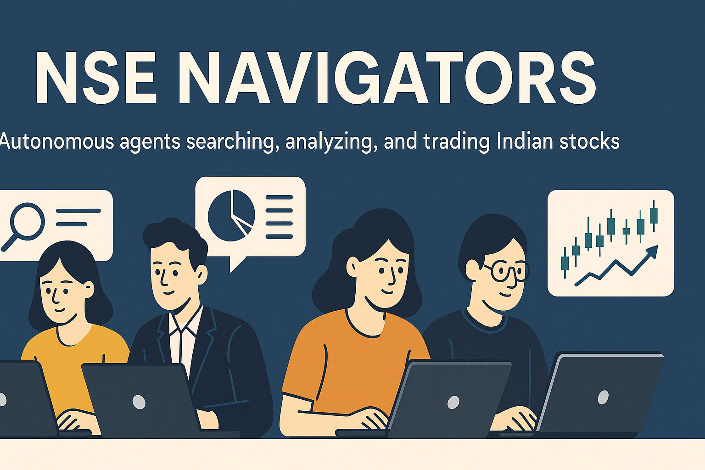

# 🚀 NSE Navigators: Autonomous Multi-Agent Indian Stock Trading System



> **NSE Navigators** is a next-generation, fully autonomous, multi-agent trading platform for Indian equities. Harnessing the power of LLMs, agentic workflows, and robust financial data tools, it delivers research, analysis, and trading—end-to-end, with zero manual intervention.

---

## 🌟 Key Features

- **Multi-Agent Intelligence:**
  - Four specialized AI agents, each with unique trading strategies and risk management protocols.
  - Agents autonomously research, analyze, and execute trades on Indian stocks.

- **Integrated Financial Data & Symbol Tools:**
  - Fast, robust symbol resolution and financial data extraction (Screener.in, Polygon-style APIs).
  - Batch and cached price fetching with rate-limit-safe, multi-agent support.

- **Agentic Workflows:**
  - Agents coordinate: one scouts market opportunities (news/trends), others perform deep financial, fundamental, and technical analysis.
  - All actions are transparent and traceable via a live dashboard.

- **Modern UI:**
  - Intuitive Gradio dashboard for real-time monitoring of agent activities, trades, and portfolio performance.

- **MCP Tooling:**
  - Modular, async-ready MCP tools and servers for symbol resolution, price/financials fetching, and Playwright-powered scraping.

- **Robust Engineering:**
  - Global, thread-safe price cache (5-min TTL, 1-sec API rate limit compliance).
  - End-to-end error handling, async best practices, and modular project structure.
  - Redis integration for fast, in-memory symbol resolution and caching.

---

## 🏗️ Project Structure

```
├── app.py                # Gradio UI & dashboard
├── accounts.py           # Portfolio, profit/loss, and account logic
├── market.py             # Price fetching, global cache, batch support
├── scraper.py            # Screener.in scraping, Playwright fallback
├── market_server.py      # MCP server, tool registration
├── traders.py            # Agent logic & workflows
├── trading_floor.py      # Agent orchestration
├── database.py           # DB queries & static methods
├── push_server.py        # Push notification MCP tool
├── requirements.txt      # Python dependencies
├── pyproject.toml        # Project metadata & dependencies
├── .gitignore            # Git exclusions
├── README.md             # This file
├── playwright_mcp_server.js # Node.js Playwright HTML fetcher
└── ...
```

---

## 🤖 How It Works

1. **Symbol Resolution:**
   - Fast, in-memory MCP tool resolves company names/symbols for all agents.
2. **Data Fetching:**
   - Financials, prices, and technicals fetched via robust, rate-limited, cached tools.
3. **Agent Workflows:**
   - Agents coordinate: scout, analyze, and trade using LLMs and MCP tools.
4. **Portfolio Management:**
   - Real-time profit/loss, holdings, and trade history—fully automated.
5. **Live Dashboard:**
   - Monitor agent actions, trades, and portfolio value in a beautiful UI.

---

## 🛠️ Installation & Setup

1. **Clone the repo:**
   ```sh
   git clone https://github.com/DarshanR1510/nse-navigators.git
   cd nse-navigators
   ```
2. **Install Python dependencies:**
   ```sh
   pip install -r requirements.txt
   ```
3. **Install Node.js dependencies (for Playwright MCP server):**
   ```sh
   cd mcp && npm install && cd ..
   ```
4. **Set up environment variables:**
   - Copy `.env.example` to `.env` and fill in your API keys (DHAN, OpenAI, etc).

---

## 🖥️ Usage

- **Start the Gradio UI:**
  ```sh
  python app.py
  ```
- **Run MCP servers/tools:**
  ```sh
  python market_server.py
  python push_server.py
  # ...
  ```
- **Test agent workflows:**
  - Use provided notebooks/scripts for end-to-end testing.

---

## 📊 Live Dashboard Preview


---

## 🧩 Extensibility
- Add new agents, strategies, or data sources with minimal code changes.
- Plug in new MCP tools or LLM providers easily.

---

## 📝 License

MIT License. See [LICENSE](LICENSE) for details.

---

## 👤 Author

- **Darshan Ramani**  
  [darshanramani1@gmail.com](mailto:darshanramani1@gmail.com)
  
  [GitHub](https://github.com/DarshanR1510)

---

## ⭐ Star this repo if you like it!

> _NSE Navigators: The future of AI-driven Indian stock trading._
